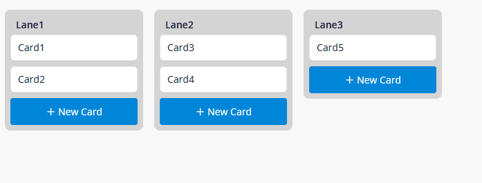

## Kanban Drag & Drop

This widget provides an interactive board where users can move cards between lanes. It supports customizable lane content, card content, and smooth drag-and-drop interactions.

## Features

- Enables drag and drop of cards between lanes. 
- Lanes and cards are fully configurable through Mendix data sources.
- Actions following the drop can be configured in a drop microflow.
- The layout of lanes can be customized, including lane width, optional bottom sections, and empty-lane sections.
- On drop microflow rights determines whether user is allowed to drag and drop

## Data

- The widget requires a data source for lanes and a data source for cards.
- Each lane must provide an attribute that defines the order of lanes and an identifier attribute that is unique and stable.
- Each card must provide an attribute that defines its order within the lane and a reference from Card to Lane.

## On drop

When a card is moved, the widget will set the target lane identifier and the new sort key. You must configure two attributes: one for the target lane id (string, integer, or long) and one for the new sort key (decimal). You must also configure a microflow or nanoflow as the on drop action. This flow receives the moved card and is responsible for updating its lane association and sort key.

## Layout

- Lane width can be set as a CSS value such as 300px or 40 percent.
- You can enable or disable the footer and empty section per lane.

## Usage

1. Add the widget to your page or snippet.
2. Bind the lanes and cards data sources.
3. Configure the lane identifier so that it is unique.
4. Configure the card sort key and the Card to Lane association.
5. Create a helper entity with attributes for the target lane id and the new sort key.
6. Configure the on drop action microflow or nanoflow. The flow should update the Card to Lane association and the Card sort key using the values set by the widget, then commit the card.
7. Customize the lane and card templates to match the desired styling.

An example of the configuration of the widget is available in the module. 

## Notes

- The lane identifier must always be unique and non-empty. Use an AutoNumber or UUID string to guarantee this.
- Empty lanes are displayed as long as they are included in the lanes data source.
- Cards are only shown if they are included in the card data source. Filtering the card data source will hide other cards, even if they belong to visible lanes.
- This widget is not react only. In project settings -> runtime -> make sure "Use react client" is set to No. 